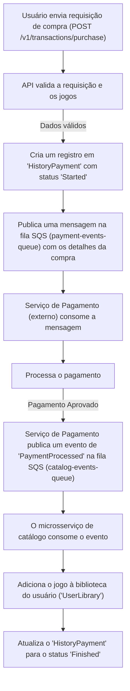
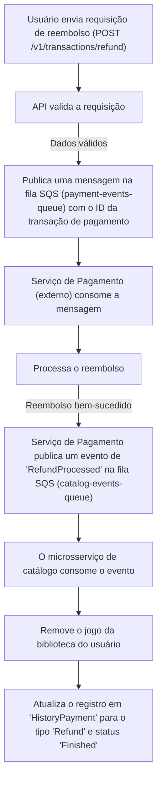

# 🚀 Tech Challenge Games

`tech-challenge-games` é um microsserviço para gerenciamento de catálogo de jogos, promoções e bibliotecas de usuários para uma plataforma de jogos digitais.

# 🎯 Objetivos

  - Gerenciar um catálogo de jogos, incluindo funcionalidades de busca e recomendação.
  - Controlar bibliotecas de jogos individuais por usuário.
  - Gerenciar promoções aplicáveis aos jogos.
  - Processar transações de compra e reembolso de forma assíncrona.
  - Servir como base para um sistema escalável e modular de jogos via API RESTful.

# 📃 Funcionalidades principais:

  - **Gestão de Jogos**: CRUD completo para jogos, com integração ao Elasticsearch para buscas e recomendações.
  - **Gestão de Promoções**: Crie e gerencie promoções com data de início e fim, aplicando descontos a jogos específicos.
  - **Biblioteca de Usuário**: Cada usuário possui uma biblioteca para armazenar os jogos adquiridos.
  - **Sistema de Transações**: Processa compras e solicitações de reembolso de forma assíncrona utilizando AWS SQS.

# 🔍 Busca Avançada com Elasticsearch

O microsserviço utiliza o Elasticsearch para fornecer funcionalidades de busca e análise de dados de forma rápida e eficiente. Quando um jogo é criado, atualizado ou removido no banco de dados principal (PostgreSQL), essas alterações são sincronizadas com o Elasticsearch para manter os dados de busca sempre atualizados.

A API expõe os seguintes endpoints para interação com o Elasticsearch:

  - **Busca de Jogos (`GET /v1/games/search?searchTerm={termo}`)**:

      - Realiza uma busca textual por jogos, pesquisando nos campos de nome e descrição.
      - Utiliza busca com "fuzziness" para corrigir pequenos erros de digitação.

  - **Recomendações (`GET /v1/games/{id}/recommendations`)**:

      - A partir do ID de um jogo, encontra outros jogos do mesmo gênero, servindo como um sistema de recomendação de jogos similares.

  - **Sumário de Gêneros (`GET /v1/games/genres/summary`)**:

      - Fornece uma agregação que conta quantos jogos existem para cada gênero, útil para criar dashboards e análises.

# ⚙️ Dependências

O projeto utiliza as seguintes bibliotecas principais:

  - Microsoft.EntityFrameworkCore
  - Npgsql.EntityFrameworkCore.PostgreSQL
  - Elastic.Clients.Elasticsearch (para buscas e recomendações)
  - AWSSDK.SQS & AWSSDK.SimpleNotificationService (para mensageria)
  - Swashbuckle.AspNetCore (Swagger)
  - Serilog (para logging estruturado com Elasticsearch)
  - FluentValidation (para validação de entidades)

# 🔄️ Fluxos

## 🛒 Fluxo de Compra de Jogo

## 🔙 Fluxo de Reembolso de Jogo

# 🗃️ Estrutura do Banco de Dados

## 📼 Tabela de Game

| Coluna | Tipo | Descrição |
| :--- | :--- | :--- |
| Id | UUID PRIMARY KEY | ID único do jogo. |
| Name | VARCHAR(100) | Nome do Jogo. |
| Description | VARCHAR(100) | Descrição do Jogo. |
| Genre | VARCHAR(100) | Gênero do Jogo. |
| Price | DECIMAL(18,2) | Preço do Jogo. |
| IsActive | BOOLEAN | Indica se o jogo está ativo. |
| CreatedAt | TIMESTAMP | Data de criação do registro. |
| UpdatedAt | TIMESTAMP | Data da última atualização do registro. |

## 🎉 Tabela de Promotion

| Coluna | Tipo | Descrição |
| :--- | :--- | :--- |
| Id | UUID PRIMARY KEY | ID único da promoção. |
| Name | VARCHAR(100) | Nome da promoção. |
| StartDate | TIMESTAMP | Data de início da promoção. |
| EndDate | TIMESTAMP | Data de término da promoção. |

## 🗄️ Tabela de UserLibrary

| Coluna | Tipo | Descrição |
| :--- | :--- | :--- |
| Id | UUID PRIMARY KEY | ID único da biblioteca. |
| UserId | UUID | ID do usuário (vindo de outro serviço, via JWT). |

## 📋 Tabela de LibraryItem

| Coluna | Tipo | Descrição |
| :--- | :--- | :--- |
| Id | UUID PRIMARY KEY | ID único do item na biblioteca. |
| UserLibraryId | UUID FK | Referência à biblioteca do usuário. |
| GameId | UUID FK | Referência ao jogo. |
| PurchasedAt | TIMESTAMP | Data da aquisição do jogo. |
| PurchasePrice | DECIMAL(18,2) | Preço pago pelo jogo. |

## 📜 Tabela de HistoryPayment

| Coluna | Tipo | Descrição |
| :--- | :--- | :--- |
| Id | UUID PRIMARY KEY | ID único da transação histórica. |
| PaymentTransactionId | UUID | ID da transação no gateway de pagamento (atualizado após o processamento). |
| Status | INT | Status da transação (Iniciada, Cancelada, Finalizada). |
| Type | INT | Tipo da transação (Compra, Reembolso). |
| CreatedAt | TIMESTAMP | Data de criação da transação. |
| UpdatedAt | TIMESTAMP | Data da última atualização da transação. |

